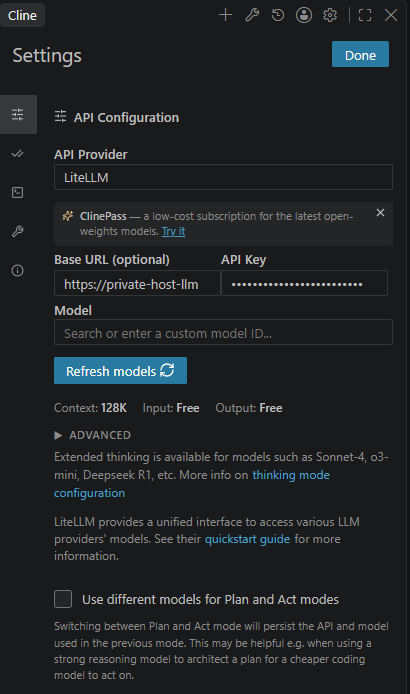

## `Cline` VSCode Plugin


1. API Provider=`LiteLLM`
1. Base URL=`http://hostname:4000` ()
1. API Key=`sk-x....` Create thsi key in your LiteLLM dashboard
1. Click `Refresh Models`
1. Save
1. Copy [`.clinerules`](.clinerules) file to your workspace
1. **!!!! Edit `~/.cline/data/globalState.json` !!!!**
    ```json
    // ~/.cline/data/globalState.json
    {
        ...
        "actModeLiteLlmModelInfo": {
            "name": "modelName", 
            "contextWindow": 128000, # <- Ask your API provider e.g. 32000
            "maxTokens": -1,         # <- Ask your API provider e.g. 4096
            ...
            "inputPrice": 0,         # <- Ask your API provider e.g. 3e-8
            "outputPrice": 0,        # <- Ask your API provider e.g. 9e-8
        ...
    }
    ...
    }
    ```
1. Restart `VS Code`


